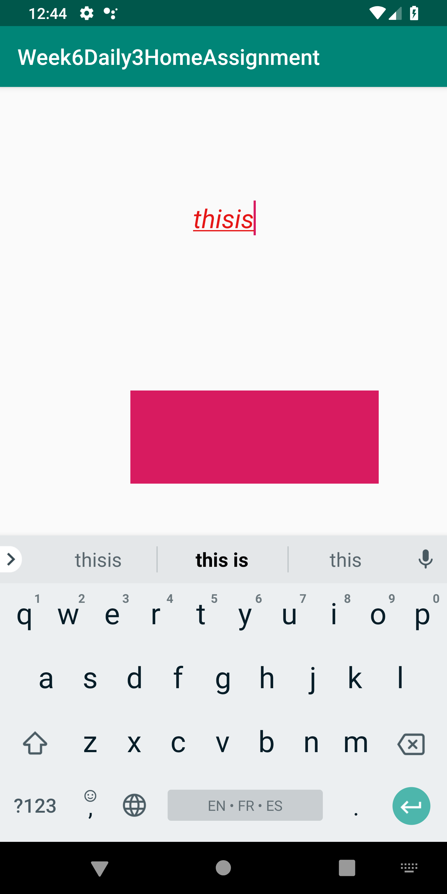
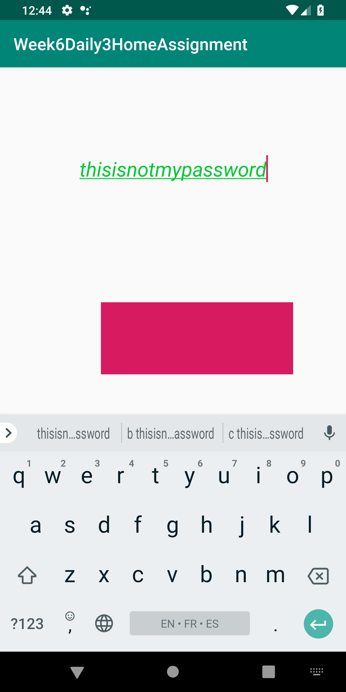
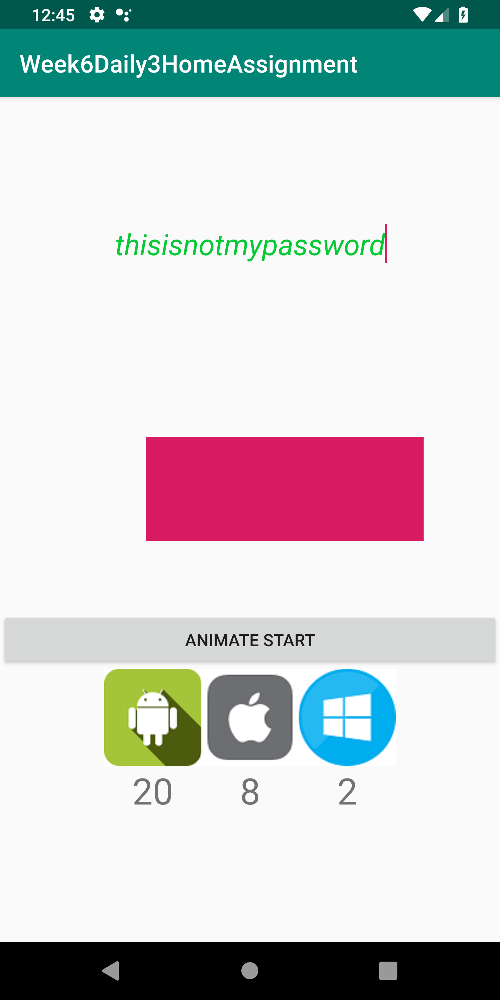
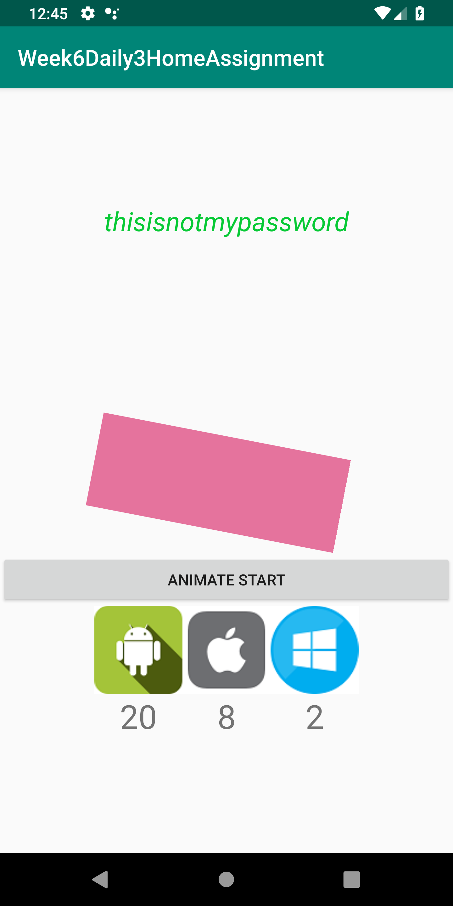
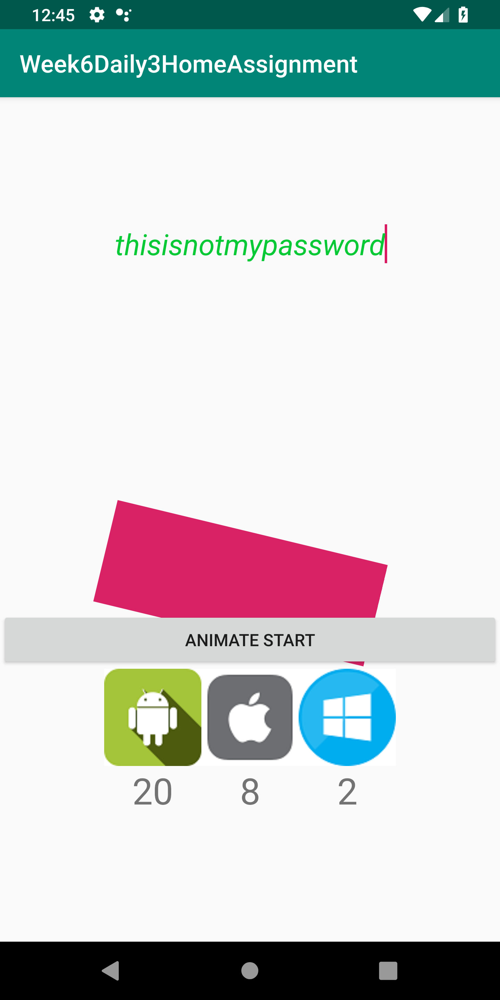
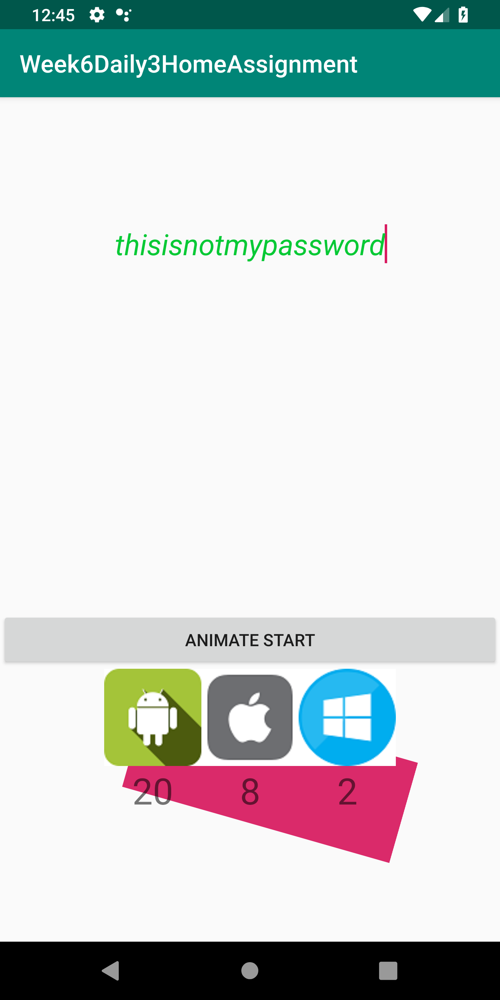

# Week6Daily3HomeAssignment
A custom view with a rectangle. A compound view with 3 icons and a counter to keep track of how many times clicked. A custom edittext where the text is red until the length is at least 8 chars. A button that when clicked will start the custom rectangle animation.  

App started.

Typing in the custom Edittext. As text length is less than 8 text color is red.

As text length is now greated than 8 text color is green.

clicking icons will show clicking number below of every icons.

Clicked the animate start button. animations starts.

animation is going on.

Animation is still going on.

